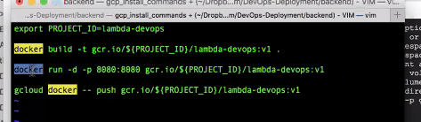
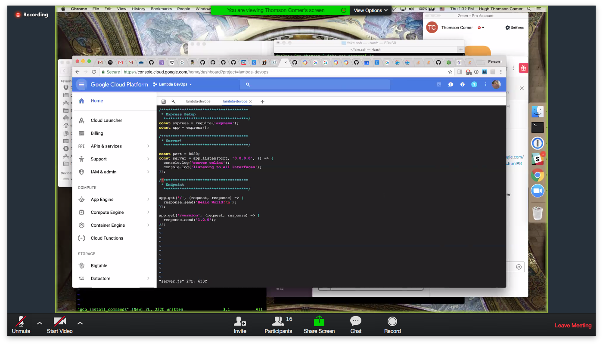
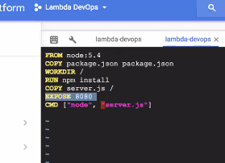

# DevOps and Deployment
## Course Introduction - OKAY √

Software is great and all. But truly nothing matters except delivery. This course is intended to teach you the philosophy of Continuous Deployment. Continuous Deployment refers to automatically making any submitted code available for testing every time a code change is submitted. Many engineers today believe that this method results in more reliable code. In addition to teaching you about Continuous Deployment (or Continuous Integration), this course will also teach you to create a deployment of one of your Lambda School projects using this method.

## What is DevOps? - OKAY √

DevOps is the complicated framework that surrounds transmitting your code from your local machine to the public. The specific steps taken to perform this transmission (aka: deployment) are extremely varied. There are many dozens of web sites dedicated to helping you deploy your code to the internet and collect a small fee from you for this service. Regardless of which service or technology you use, DevOps is always loosely comprised of the following steps:

1. Connecting a computer to a network (usually the internet).
2. Installing and configuring an operating system on that computer.
3. Installing software on that computer that can open a socket and respond to incoming traffic.
4. Customizing the above software to perform a specific business, entertainment, or hobby-related task.
5. Configuring the above software to become failure tolerant (automatically restart).
6. Configuring the above software to be data-consistent.

The above steps are sufficient to take your local software development project to the public. You can trivially hire a service to perform the first 3 steps, leaving you only with the remaining 3. You can ignore steps 5 and 6, leaving them up to the software configured in 2, and you can create static websites that aren't subject to the issues in steps 5 and 6. Geocities, [Wordpress](https://www.wordpress.com), [Small Victories](https://www.smallvictori.es/), and many other sites allow you to implement only step #4. If you wish to be a professional web developer, you will need to learn the rest of the steps.

Finally, the above steps only create a relatively brittle site. In particular, these steps don't help at all with the development process - that is, the process of writing and refining your application code to become reliable, feature-rich, and bug free. These steps in particular do not scale well for projects that are not toys: most development projects involve many developers, technologies being developed in parallel, and thousands or millions of expectant customers waiting for each revision. In order to safely and effectively deliver code to the world at large, more development is needed.

## Mini Sprint: - OKAY √

The above notes about DevOps.

- Domain names - ICANN and Namecheap, WHOIS, A records
- Security - HTTPS and Digicert, self signed HTTPS
- Scalability - Dedicated hosts versus your own hosts

### Basic Hosting: - OKAY √

- Name servers and virtual hosts via CPanel and SSH (Godaddy, Geocities)
  - https://help.github.com/articles/generating-a-new-ssh-key-and-adding-it-to-the-ssh-agent/
  - https://help.github.com/articles/adding-a-new-ssh-key-to-your-github-account/
- Super lightweight hosts like Small victories

### Local Hosting: - DONE √

Now, get [ngrok](https://ngrok.com/) and start using it with the free account. Choose a personal or Lambda web site project that you'd like to share with the rest of class (and the world), run it on your local machine, and share it with us using `ngrok`.

Installing ngrok: https://gist.github.com/wosephjeber/aa174fb851dfe87e644e
```
# cd into your local bin directory
cd /usr/local/bin

# create symlink
ln -s /Applications/ngrok ngrok
```

- Also, homebrew, macports, npm and such...

### Advanced Hosting:

The rest of this document

## Continuous Deployment

    Any sufficiently advanced Ops is indistinguishable from Dev
    - Baron Schwartz @xaprb -

### Advanced DevOps:

1. Steps 1 and 2 from above can be automated to a degree
2. Write software that loads software from elsewhere
3. Test the software as soon as it is loaded from elsewhere (unit and integration tests)
4. Build/compile/deploy the software to the same computer or another computer
5. Report on test and build results to another computer automatically
6. Monitor the stability of the deployed software
7. Add more software when traffic increases, remove it when it decreases (Load balancing)
8. Hosting servers in different physical locations in order to improve performance and fault tolerance
9. Splitting up data in different locations to improve performance and fault tolerance

# Sprint: - Whoa!

Topics:

- Hosting and network/device security
- Ngrok
- Static hosting
- Shared environment hosting
- Dedicated server hosting
- Front end hosting
- Database hosting
- Cloud hosting & **G**oogle **C**loud **P**latform
- Microservers
  - Different servers for different jobs
  1. Front end server
  2. Database server
  3. Authentication server
  4. Micro services
  5. Integration server
- Web servers(nginx) and simple servers(express)
- Google, AWS, Heroku, Azure, etc
- Containerization
- Automated test
- Automated deployment
  Whenever you push to a specific Git branch, your integration server receives a Git Hook, requesting that the repository be built, tested, and deployed.
- Versioning
  Every piece of software is running a specific version. Version numbers actually reference a specific container configuration and a specific git commit version.
- Manual Testing
- Security in motion (HTTPS)
- Security at rest (ssh, pub/priv key encryption, MFA, password danger, etc)

# Assignment: - OKAY √
The following assignment is extremely difficult. Do not lose heart if you are lost or struggling. In professional work I would allow between 1-3 weeks of 8 hour days of development to accomplish the following goals.

Let's build a CI pipeline:

You need:
- A front end in a repository
- Unit tests for your front end
- A back end in a repository
- Integration tests for your back end

You will:
Follow instructions at GCP for creating a Docker container for your repository

**Google Cloud Platform** to host a back end:
[Quick GCP setup](https://codelabs.developers.google.com/codelabs/cloud-slack-bot/index.html#0)

Your back end will be an express server with two endpoints:

    /version - returns the current software version
    /time - returns the current time

Ignore everything about the slack bot, except that kittenbot.js will actually be an express server. Do not try to create a slack bot or get its access token. We're using this tutorial because it builds a GCP container very quickly.

Then, test your docker container with the command line:
- Is it running? (curl localhost:port)
  - `$ curl localhost:8080`
- Can you stop it (docker command)
  - `$ docker stop <container@#>`
- Can you start it again? (docker command)
  - `$ docker start <container@#>`

#### From Slack chat & lecture:
- [Simple Dev Ops](https://www.lucidchart.com/invitations/accept/4854f86f-f03b-4877-8b27-d6caeca774f0)
- [Continous Integration](https://www.lucidchart.com/invitations/accept/bcf25fe7-0ceb-4f5c-966b-97705455d0a3)
- https://cloud.google.com/source-repositories/docs/connecting-hosted-repositories
- https://cloud.google.com/source-repositories/docs/adding-repositories-as-remotes
- https://cloud.google.com/source-repositories/docs/quickstart

- I DO ALREADY HAVE `~/.ssh/id_rsa` in my local computer √ But... I am not making use of it...
> ...use this one to create `~/.ssh/id_rsa` if you don't already have it
> https://help.github.com/articles/generating-a-new-ssh-key-and-adding-it-to-the-ssh-agent/
- ...continued:

Google Cloud platform to host a front end:
[Quick GCP setup](https://codelabs.developers.google.com/codelabs/cloud-slack-bot/index.html#0)

#### HA - I didn't need to manually `npm i` the front/backend :P

```console
Welcome to Cloud Shell! Type "help" to get started.
kennedy@blissful-acumen-179906:~$ git clone https://github.com/mixelpixel/DevOps-Deployment.git
Cloning into 'DevOps-Deployment'...
remote: Counting objects: 75, done.
remote: Compressing objects: 100% (27/27), done.
remote: Total 75 (delta 19), reused 28 (delta 11), pack-reused 36
Unpacking objects: 100% (75/75), done.
kennedy@blissful-acumen-179906:~$ cd DevOps-Deployment/
kennedy@blissful-acumen-179906:~/DevOps-Deployment$ cd patrick/frontend
kennedy@blissful-acumen-179906:~/DevOps-Deployment/patrick/frontend$ npm install
npm WARN prefer global node-gyp@3.6.2 should be installed with -g
> node-sass@4.5.3 install /home/kennedy/DevOps-Deployment/patrick/frontend/node_modules/node-sass
> node scripts/install.js
Downloading binary from https://github.com/sass/node-sass/releases/download/v4.5.3/linux-x64-48_binding.node
Download complete .] - :
Binary saved to /home/kennedy/DevOps-Deployment/patrick/frontend/node_modules/node-sass/vendor/linux-x64-48/binding.node
Caching binary to /home/kennedy/.npm/node-sass/4.5.3/linux-x64-48_binding.node
> uglifyjs-webpack-plugin@0.4.6 postinstall /home/kennedy/DevOps-Deployment/patrick/frontend/node_modules/uglifyjs-webpack-plugin
> node lib/post_install.js
> node-sass@4.5.3 postinstall /home/kennedy/DevOps-Deployment/patrick/frontend/node_modules/node-sass
> node scripts/build.js
Binary found at /home/kennedy/DevOps-Deployment/patrick/frontend/node_modules/node-sass/vendor/linux-x64-48/binding.node
Testing binary
Binary is fine
LS-React-1@1.0.0 /home/kennedy/DevOps-Deployment/patrick/frontend
...
```

This is the same tutorial as for the back end.

```console
kennedy@blissful-acumen-179906:~/DevOps-Deployment/patrick/backend$ npm install
backend@1.0.0 /home/kennedy/DevOps-Deployment/patrick/backend
├─┬ express@4.15.4
...
├─┬ request@2.81.0
...
└─┬ request-promise@4.2.1
  ├── bluebird@3.5.0
  ├─┬ request-promise-core@1.1.1
  │ └── lodash@4.17.4
  └── stealthy-require@1.1.1
npm WARN backend@1.0.0 No description
npm WARN backend@1.0.0 No repository field.
```


**Ignore the stuff about the slack bot.**
- ha whoops: https://lambdauniversity.slack.com/messages/C731DVC1K/

# HA - IGNORE THIS BOTKIT STUFF
```console
$ vi botkit.js
```

```js
var Botkit = require('botkit')
var fs = require('fs') // NEW: Add this require (for loading from files).
var controller = Botkit.slackbot({debug: false})
// START: Load Slack token from file.
if (!process.env.slack_token_path) {
  console.log('Error: Specify slack_token_path in environment')
  process.exit(1)
}
fs.readFile(process.env.slack_token_path, function (err, data) {
  if (err) {
    console.log('Error: Specify token in slack_token_path file')
    process.exit(1)
  }
  data = String(data)
  data = data.replace(/\s/g, '')
  controller
    .spawn({token: data})
    .startRTM(function (err) {
      if (err) {
        throw new Error(err)
      }
    })
})
// END: Load Slack token from file.
controller.hears(
  ['hello', 'hi'], ['direct_message', 'direct_mention', 'mention'],
  function (bot, message) { bot.reply(message, 'Meow. :smile_cat:') })

```

# DOCKERFILE

```console
$ vi Dockerfile
```

```Docker
FROM node:5.4
COPY package.json package.json
WORKDIR /
RUN npm install
COPY server.js /
EXPOSE 8080
CMD ["node", "/server.js"]
```

```console
export PROJECT_ID=lambda-devops
or
export PROJECT_ID=$(gcloud config list --format 'value(core.project)')

docker build -t gcr.io/${PROJECT_ID}/lambda-devops:v1 .

docker run -d -p 8080:8080 gcr.io/${PROJECT_ID}/lambda-devops:v1

gcloud docker -- push gcr.io/${PROJECT_ID}/lambda-devops:v1

gcloud container clusters create lambda-devops-cluster \
      --num-nodes=2 \
      --zone=us-central1-f \
      --machine-type n1-standard-1
```

```console
$ docker ps   <--- find the container ID
$ docker stop @#
$ docker start @#
```





```
Welcome to Cloud Shell! Type "help" to get started.
mrkennedy@blissful-acumen-179906:~$ curl localhost:8080
Hello World!
mrkennedy@blissful-acumen-179906:~$ curl localhost:8080/version
1.0.0
```

Instead, you will check out this repository to the docker container:

FOR THE YAML FILE:
```
apiVersion: extensions/v1beta1
kind: Deployment
metadata:
  name: lambda-devops
spec:
  replicas: 1
  strategy:
    type: Recreate
  template:
    metadata:
      labels:
        app: lambda-devops
    spec:
      containers:
      - name: master
        image: gcr.io/PROJECT_ID/lambda-devops:v1
        ports:
          - containerPort: 8080
```

`kubectl get services`

`kubectl get pods`

`kubectl port-forward lambda-devops-1926634773-hffqh 8080:8080`

`kubectl expose deployment lambda-devops --type=LoadBalancer  --name=my-service`

> Q: if I made a change to my server.js how much of this do we have to redo for it to show up at the IP
> A: You have to rebuild the docker container, but you don't have to rebuild the Dockerfile `docker build` with a NEW version at the end `v1` has to become `v1.1` (edited)
> You have to push the docker container - pushing it to `gcr.io`
> You have to modify the `image` line in your yaml file with the correct version
> Then you do `kubectl create`


[Set up Jenkins on Container Engine](https://cloud.google.com/solutions/jenkins-on-container-engine-tutorial#top_of_page)

[Jenkins on GCP, long](https://cloud.google.com/solutions/continuous-delivery-jenkins-container-engine)


Your front end will be a React app that displays its own version, the back end's version, and the time from the back end.

    // Reference commands, you will find them in the above tutorials.
    brew install docker
    do (https://cloud.google.com/sdk/docs/#mac)
    ./google-cloud-sdk/install.sh
    gcloud init
    gcloud config list
    gcloud components install kubectl
    create project at (https://console.cloud.google.com)
    after created, check Container Engine, Container clusters, Container Registry
    gcloud config set project lambda-XXXXXX
    gcloud container clusters create lambda-cluster
    gcloud config set container/cluster lambda-cluster
    gcloud container clusters get-credentials lambda-cluster --zone us-central1-a --project lambda-XXXXXX
    kubectl proxy
    http://localhost:8001/ui
